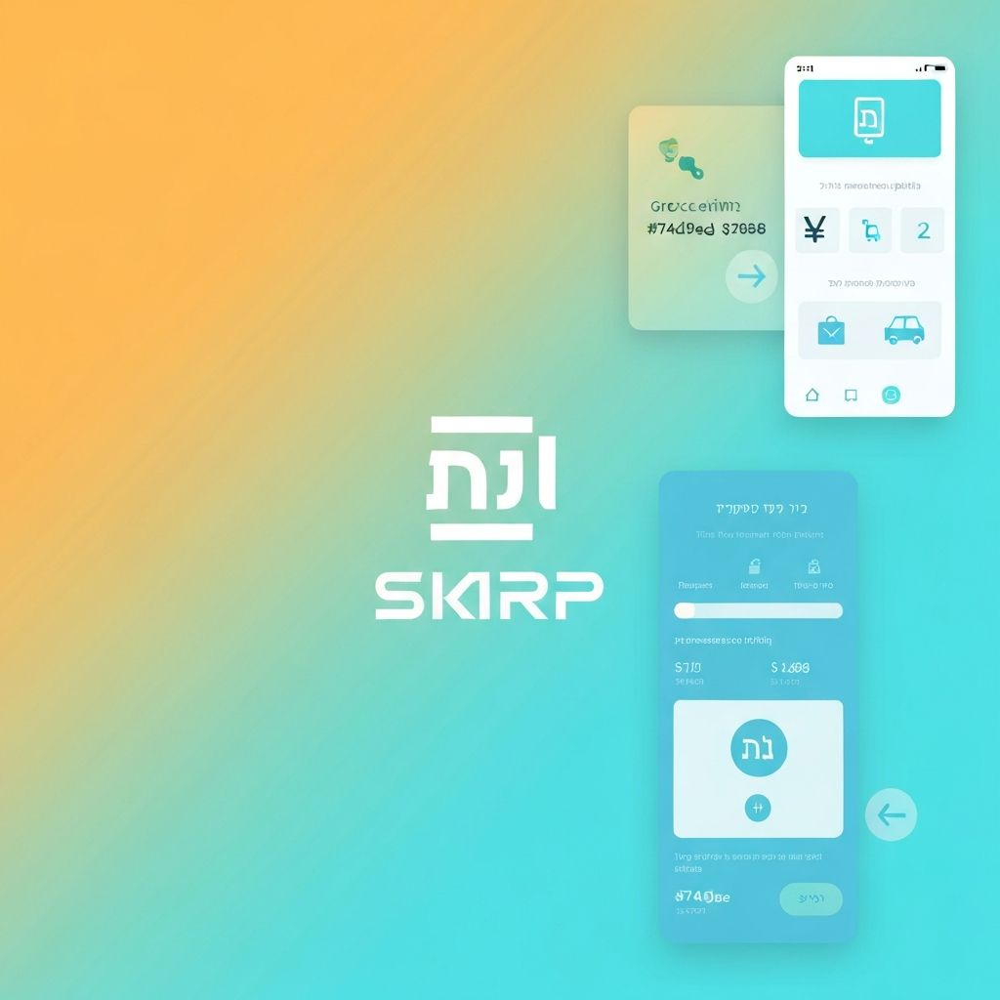
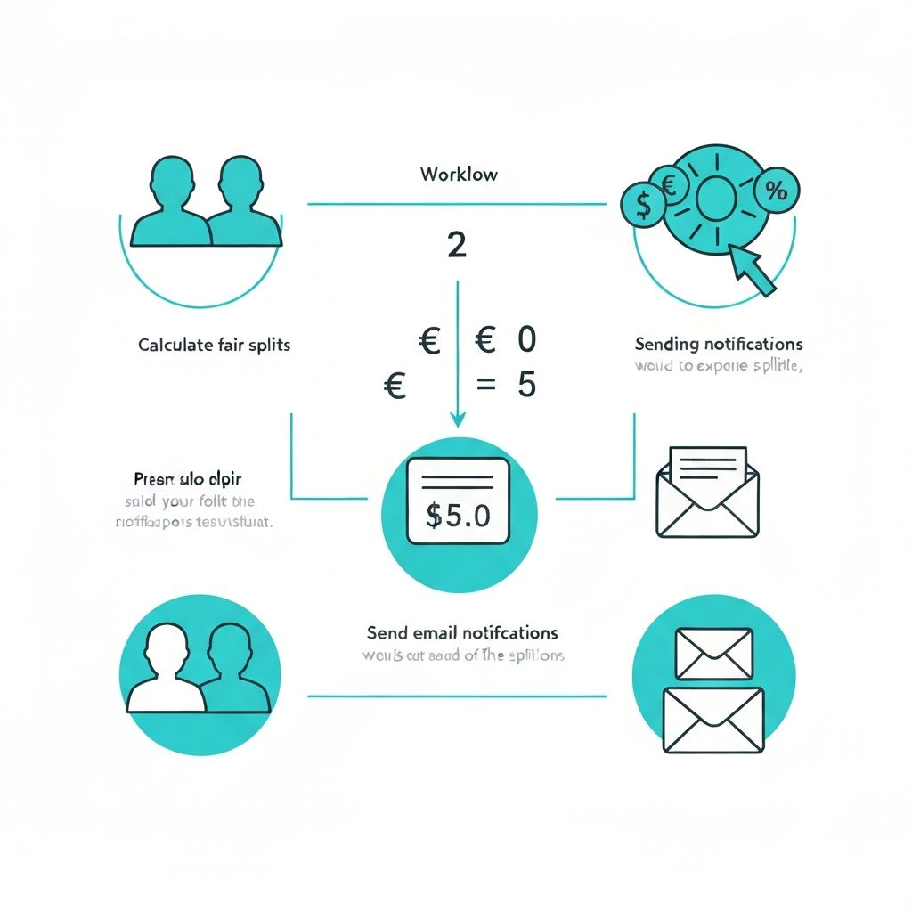
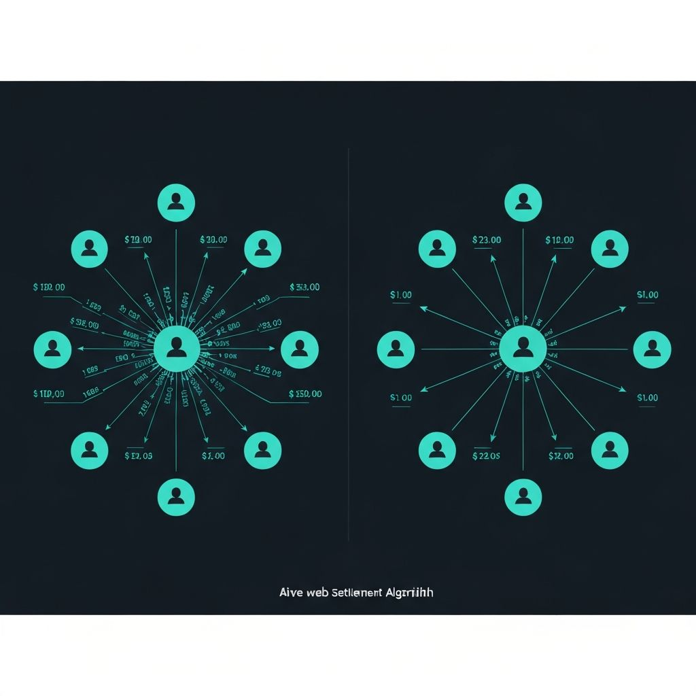

<div align="center">



# Expense Splitter

### Split expenses fairly. Settle smartly. Collaborate in real-time.

[](https://v0.app/chat/nsgbzTtiI6V)
[](https://vercel.com/miriamdunners-projects/v0-expense-splitting-app)
[](https://nextjs.org)
[](https://typescriptlang.org)
[](https://react.dev)
[](https://tailwindcss.com)

---

**A modern, full-stack collaborative expense splitting application** with shared event rooms, real-time group chat, and a smart settlement algorithm that minimizes the number of transactions needed.

Built with **AI-assisted smart coding (vibe coding)** using [v0.app](https://v0.app), then customized and refined to match my exact requirements.

[Live Demo](https://vercel.com/miriamdunners-projects/v0-expense-splitting-app) | [Report Bug](https://github.com/MiriamDunner/expense-splitting-app/issues) | [Request Feature](https://github.com/MiriamDunner/expense-splitting-app/issues)

</div>

---

## Features



| Feature | Description |
|---------|-------------|
| **Event Rooms** | Create or join password-protected shared events - multiple users collaborate on the same expense list in real-time |
| **Event Lobby** | Beautiful landing screen to create a new event or join an existing one with name + password authentication |
| **Smart Settlement Algorithm** | Minimizes the number of transactions using a greedy creditor-debtor matching approach |
| **Real-time Group Chat** | Built-in chat panel per event with identity selection, message bubbles, timestamps, and avatars |
| **Identity System** | Each user selects their identity from the participant list before chatting - prevents impersonation |
| **Event Top Bar** | Persistent header showing current event name, participant count, connection status, and a leave button |
| **Full Hebrew RTL Support** | Complete right-to-left interface with proper Hebrew localization |
| **New Israeli Shekel (NIS)** | All amounts displayed in NIS currency |
| **Real-time Validation** | Instant input validation with email format checking, required field indicators, and visual feedback |
| **Beautiful Email Notifications** | Professionally designed HTML emails sent via Resend API with personalized settlement details |
| **Responsive Design** | Looks great on desktop, tablet, and mobile - chat adapts from side panel to bottom drawer |
| **Smooth Animations** | Polished micro-interactions, card transitions, floating decorative elements, and hover effects |
| **Session Persistence** | Rejoin your current event automatically if you refresh the page |
| **FastAPI Backend** | Alternative Python backend with Pydantic validation and auto-generated API docs |

---

## How It Works



### App Flow

```
1. Create Event          2. Share Credentials       3. Collaborate
   Enter a name             Friends join with         Add participants,
   + password               event name + password     expenses, and chat

4. Calculate              5. Settle                  6. Notify
   Smart algorithm          See who owes whom           Send personalized
   minimizes transfers      in minimal transactions     emails to everyone
```

### The Settlement Algorithm

The core algorithm minimizes the number of money transfers needed to settle all debts:

1. **Calculate fair share** - Total expenses divided equally among all participants
2. **Compute balances** - Each person's payment minus their fair share (positive = creditor, negative = debtor)
3. **Sort and match** - Creditors sorted descending, debtors sorted ascending by balance
4. **Greedy settlement** - Match the largest creditor with the largest debtor, transfer the minimum of both balances, repeat

**Example:**
> 4 friends go on a trip. Instead of 12 possible transactions (everyone paying everyone), the algorithm reduces it to just 2-3 optimal transfers.

```
Before (naive):     After (optimized):
A -> B: 50          A -> C: 80
A -> C: 30          B -> C: 40
B -> C: 40
B -> D: 10
D -> C: 20
```

---

## Tech Stack

| Layer | Technology |
|-------|-----------|
| **Framework** | Next.js 16 (App Router) |
| **Language** | TypeScript 5 |
| **UI Library** | React 19.2 |
| **Styling** | Tailwind CSS 4 + shadcn/ui |
| **Icons** | Lucide React |
| **Email Service** | Resend API |
| **Alt. Backend** | Python FastAPI + Pydantic |
| **Deployment** | Vercel |

---

## Quick Start

### Prerequisites

- Node.js 18+
- npm or yarn

### Installation

```bash
# Clone the repository
git clone https://github.com/MiriamDunner/expense-splitting-app.git

# Navigate to project directory
cd expense-splitting-app

# Install dependencies
npm install

# Start development server
npm run dev
```

Open [http://localhost:3000](http://localhost:3000) in your browser.

### Email Configuration (Optional)

To enable real email sending, add your Resend API key:

```bash
# Add to your environment variables
RESEND_API_KEY=re_your_api_key_here
```

> Without the API key, the app runs in preview mode and logs email content to the console.

### FastAPI Backend (Optional)

```bash
# Install Python dependencies
pip install -r scripts/requirements.txt

# Start the API server
python scripts/fastapi_server.py
```

API docs available at [http://localhost:8000/docs](http://localhost:8000/docs)

---

## Project Structure

```
expense-splitting-app/
├── app/
│   ├── api/
│   │   ├── calculate-settlement/   # Settlement algorithm API
│   │   ├── events/                  # Event CRUD (create, join, update)
│   │   ├── messages/                # Chat messages API per event
│   │   └── send-notifications/      # Email notification API
│   ├── globals.css                  # Theme & design tokens
│   ├── layout.tsx                   # RTL Hebrew layout
│   └── page.tsx                     # Lobby / Room router
├── components/
│   ├── chat/
│   │   ├── chat-panel.tsx           # Floating chat side panel / drawer
│   │   ├── identity-modal.tsx       # "Who are you?" selector
│   │   ├── message-item.tsx         # Single message bubble
│   │   └── message-list.tsx         # Scrollable message feed
│   ├── event-lobby.tsx              # Create / Join event screens
│   ├── event-room.tsx               # Main event workspace
│   ├── event-top-bar.tsx            # Sticky header with event info
│   ├── expense-form.tsx             # Participant input form
│   ├── settlement-summary.tsx       # Results & email sending
│   └── ui/                          # shadcn/ui components
├── scripts/
│   ├── fastapi_server.py            # Alternative Python backend
│   └── send_email_notifications.py  # Standalone email script
└── public/
    └── ...                          # Static assets & README images
```

---

## API Endpoints

| Method | Route | Description |
|--------|-------|-------------|
| `POST` | `/api/events` | Create or join an event (action: `create` / `join`) |
| `GET` | `/api/events?id=...` | Fetch event data (participants, expenses) |
| `PUT` | `/api/events` | Update event participants or expenses |
| `POST` | `/api/calculate-settlement` | Run the settlement algorithm |
| `GET` | `/api/messages?eventId=...` | Get chat messages for an event |
| `POST` | `/api/messages` | Send a chat message (with sender validation) |
| `POST` | `/api/send-notifications` | Send settlement emails to participants |

---

## About the Build Process

This project was initiated using **AI-assisted smart coding** with [v0.app](https://v0.app) - a vibe coding approach where the initial structure, components, and algorithms were generated through intelligent prompting. From there, I made significant customizations including:

- Multi-user event rooms with password-protected access
- Real-time collaborative chat system with identity management
- Full Hebrew localization with RTL support
- NIS currency integration
- Custom input validation rules
- Enhanced animations and micro-interactions
- Personalized HTML email templates
- UX refinements for maximum clarity

The result is a production-ready application that combines the speed of AI-assisted development with the precision of manual customization.

---

## License

This project is open source and available under the [MIT License](LICENSE).

---

<div align="center">

**Built with smart coding vibes** | **Customized with care**

Made by [Miriam Dunner](https://github.com/MiriamDunner)

</div>
